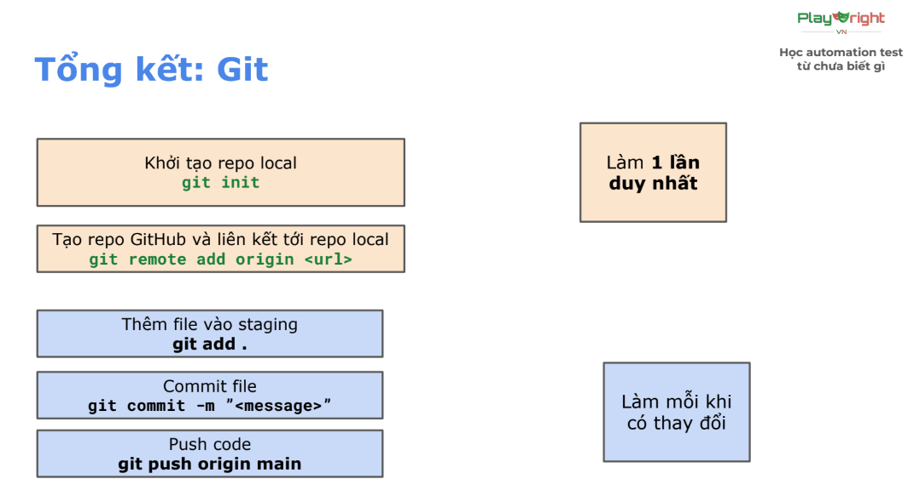
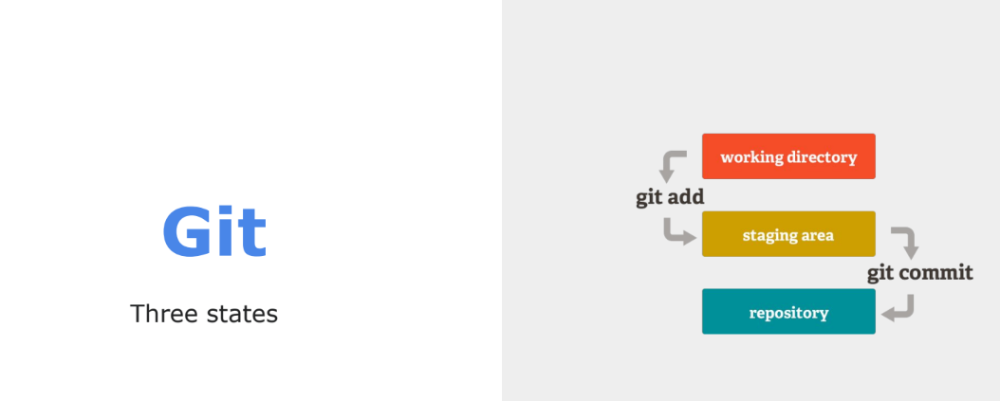
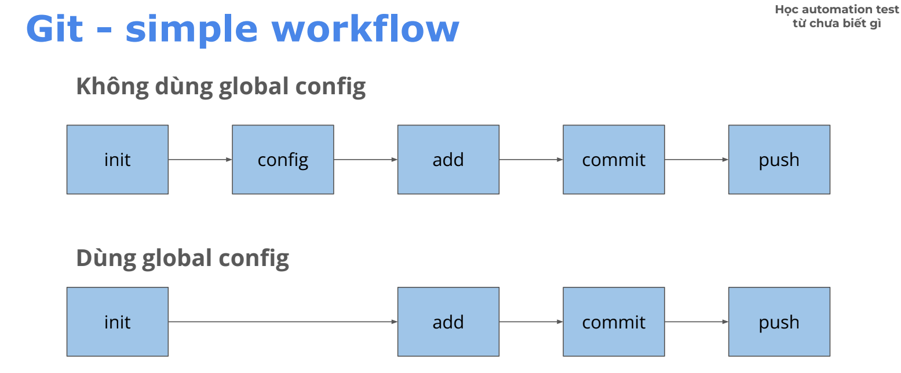

# Kiến thức tổng hợp

## 1. Git

### 1.1 Git configuration ###

**Config chung**

```powershell
- Config username
	git config --global user.name "<name>"
- Config email
	git config --global user.email "<email>"
- Config branch default '(config nhánh mặc định)'
	git config --global init.defaultBranch main
```

**Config riêng**
```bash
- Config username
	git config user.name "<name>"
- Config email
	git config user.email "<email>"
```
### 1.2 Basic Git command ###

```markdown
1. tạo repo (public) trên Github web
2. Khởi tạo
- git init (chỉ làm lần đầu khi setup)
- git remote add origin <repo github link> (chỉ làm lần đầu khi setup)
- git add .
- git commit -m "init project"
3. Push code
- git push origin main
```
```powershell
"git status" (xem trạng thái file)
- File màu 'xanh': vùng 'staging' (sau khi đã add)
- File màu 'đỏ': vùng w'orking directory' (chưa đc add)
```

```powershell
"git log" (kiểm tra danh sách commit)
```






### 1.3 "commit" convention

```markdown
<type>: <short_description>
```
- **Type**:
    - chore: sửa nhỏ lẻ, chính tả, xóa file không dùng tới
    - feat: thêm tính năng mới, test case mới
    - fix: sữa lỗi 1 test trước đó
- **short_description**: mô tả ngắn gọn (tiếng Anh hoặc tiếng Việt không dấu)

*Example:*

```ts
"chore: remove unused file"
"feat: add code for"
"fix: fix automation for case 1"
```



## JavaScript

### Biến & Hằng (let & const)

> **Biến (let)** - dùng khi cần gán giá trị

```ts
let <tên biến> = <giá trị>;
let myName = "Hieu";
```

> **Hằng (const)** - dùng khi xác định giá trị không đổi

```ts
const <tên hằng> = <giá trị>;
const pi = 3.14;
```

### Data type

**1. Number** - số nguyên và số thực (không phân biệt int/float)

```ts
const age = 25; // số nguyên
const price = 10.99; // số thực
const infinity = Infinity; // vô hạn
const notANumber = NaN; // không phải là số
```

**2. String** - chuỗi ký tự

```ts
const name = "Ryan"; // dùng nháy kép
const message = 'Hello'; // dùng nháy đơn
const template = `Age: 10`; // dùng "backtick" (dấu huyền cạnh số 1)
```

**3. Boolean** - giá trị logic

```ts
const isActive =  true; // giá trị đúng
const isComplete = false; // giá trị sai
```

```ts
hàm typeof <variable> dùng để biết 1 biến có kiểu dữ liệu là gì
```

### Toán tử so sánh

1. **So sánh bằng**
> '==' và '==='

So sánh hai bằng == (Loose Equality) - *So sánh giá trị sau khi chuyển đổi kiểu (type coercion)*

```ts
5 == "5" // true (chuyển string thành number)
5 == "6" // false (chuyển string thành number)
true == 1 // true (true chuyển thành 1)
false == 0 // true (false chuyển thành 0)
```

So sánh ba bằng === (Strict Equality) (nên dùng) - *So sánh giá trị và kiểu dữ liệu - không chuyển đổi kiểu*

```ts
5 === "5" // false (khác kiểu)
true === 1 // false (khác kiểu)
false === 0 // false (khác kiểu)
5 === 5 // true (cùng kiểu, cùng giá trị)
```
    
2. **So sánh không bằng**
> '!=' và '!=='

```ts
5 != "5" // false (chuyển string thành number)
true != 1 // false (true chuyển thành 1)
false != 0 // false (false chuyển thành 0)
```

```ts
5 !== "5" // true (khác kiểu)
true !== 1 // true (khác kiểu)
false !== 0 // true (khác kiểu)
5 !== 5 // false (cùng kiểu, cùng giá trị)
```

3. **So Sánh hơn**
> '>', '<', '<=', '>='

```ts
5 > 10 // false
5 >= 10 // false
5 < 10 // true
5 <= 10 // true
```

### Toán tử Logic

```ts
- && (AND): trả về đúng nếu cả 2 vế của mệnh đề đúng
- || (OR): trả về đúng nếu một trong 2 vế của mệnh đề đúng
```

| A | B | A AND B | A OR B |
|---|---|--------|--------|
| **True** | **True** | **True** | **True** |
| **True** | False | False | **True** |
| False | **True** | False | **True** |
| False | False | False | False |

### Toán tử 1 ngôi
- Toán tử một ngôi là toán tử **chỉ cần một toán hạng** để thực hiện.

> **Prefix**: toán tử nằm ở phía trước - **tăng trước, trả giá trị về sau**

```
- ++x;
- --x;
```

> **Postfix**: toán tử nằm ở phía sau - **trả giá trị về trước, tăng sau**

```ts
- x++;
- x--;
```
*Example:*

```ts
let a = 10;
b = ++a; // tăng a lên 11 rồi trả về 
        // => b có giá trị là 11

let c = 10;
d = c++; // trả về giá trị 10 cho d rồi mới tăng
        // => d có giá trị là 10
        // khi này nếu in c ra thì c có giá trị là 11 
```