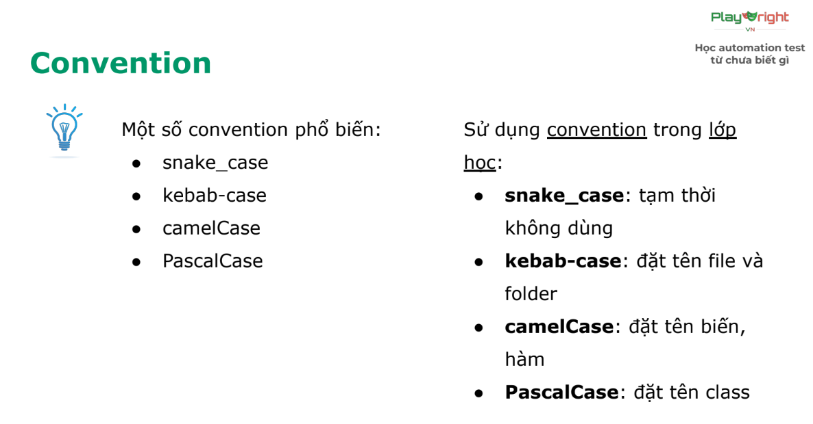

# Kiến thức tổng hợp

## 1. Git

### 1.1 Undo action ###

>**Thay đổi commit message khi commit sai**

- Thay đổi commit mới nhất

```powershell
git commit --amend -m "<message mới>"

Ex: git commit --amend -m "feat: add feature"
```

>**`Un-stage` 1 file (từ staging -> working directory)**

- Un-stage 1 file cụ thể

```markdown
git restore --staged <file>
```

- Un-stage tất cả các file

```markdown
git restore --staged .
```

>**"`Un-commit` 1 file"**

- Từ repository -> staging (đưa nội dung commit cuối về staging)

```markdown
git reset --soft HEAD~1
```

- Từ repository -> working directory (đưa nội dung commit cuối về working directory)

```markdown
git reset HEAD~1
```

 ***!!! Note !!!***

 ```markdown
- Commit đầu tiên không thể bị reset
- Nếu muốn reset -> xóa thư mục .git rồi chạy init lại
```

### 1.2 Branching ###

```bash
- "Main" là nhánh chính, "Branch" cho phép tạo ra nhánh phụ để:
  + Phát triển tính năng mới mà không ảnh hưởng tới nhánh chính đang chạy ổn định
  + Làm việc trong team, không ảnh hưởng và đè code của người khác
  + Thử nghiệm (testing), nếu hỏng thì xóa nhanh mà không ảnh hưởng gì
```

>**Các câu lệnh trong Git - branching**

- Xem danh sách các nhánh (cần có ít nhất 1 nhánh mới hiện danh sách nhánh)

```markdown
git branch
```
- Chỉ tạo nhánh, chưa chuyển sang

```markdown
git branch feature/login
```

- Chuyển sang nhánh vừa tạo

```markdown
git checkout <branch_name>
```

- Vừa tạo, vừa chuyển nhánh

```markdown
git checkout -b <branch_name>
```

- Xóa nhánh (Đứng ở `nhánh khác` trước khi xóa)

```markdown
git branch -D <tên nhánh>
```

- Đưa nhánh lên online (remote)

```markdown
git push origin <tên_nhánh>
```

- Xóa nhanh trên online (remote)

```markdown
git push -D origin <tên_nhánh>
```

### 1.3 `.gitignore`

```markdown
Dùng gitignore để:
 - Bỏ các file "nặng", file thư viện bằng cách cấu hình cho Git biết những file nào 'không cần theo dõi' (untracked by Git)
 - Bỏ các file credentials
```
```markdown
# Comment - dòng bắt đầu bằng "#" là ghi chú
```

```markdown
# Ignore file cụ thể
secret.txt
```

```markdown
# Ignore tất cả file có extension .log
*.log
```

```markdown
# Ignore thư mục
node_modules/
build/
```

```markdown
# Ignore file trong thư mục con
**/*.tmp
```

```markdown
# Ngoại lệ - Không ignore file này thì dùng "!"
!important.log
```

```markdown
# Ignore file chỉ ở thư mục gốc
/TODO
```

```markdown
# Ignore tất cả file .txt trong thư mục doc/
doc/**/*.txt
```

## 2. JavaScript

### 2.1 Câu điều kiện `if`

```markdown
Nếu đúng điều kiện thì mới chạy
```

**Examples:**

```ts
let hour = 8;
if (hour <= 11) {
    console.log(“Good morning”);
}
```

*kết hợp nhiều điều kiện*

```ts
let hour = 8;
if (hour >= 6 && hour <= 11) {
    console.log(“Good morning”);
}
```

*Kết hợp nhiều điều kiện - `nested condition`*

```ts
let hour = 8;
if (hour >= 6) {
    if (hour <= 11) {
        console.log(“Good morning”);
    }
}
```

### 2.2 Vòng lặp `for`

```markdown
- Vòng lặp dùng để lặp lại 1 đoạn logic.
- Có thể lặp một số lần nhất định, hoặc lặp vô hạn, tuỳ theo điều kiện dừng
```
> for (i)

```ts
for (let i = 0; i < 5; i++) {
    console.log("xin chào!");
}
```

### 2.3 Convention - quy tắc

```markdown
Convention giúp:
    - Code theo format chung, dễ nhìn
    - Người khác trong team dễ đọc code
Có nhiều loại Convention:
    - Đặt tên file/folder
    - Đặt tên biến
    - Đặt tên class
```

`snake case` - tất cả các chữ viết thường, cách nhau bởi dấu gạch dưới

```ts
vo_minh_hieu
```

`kebab-case` - tất cả các chữ viết thường, cách nhau bởi dấu gạch ngang

```ts
vo-minh-hieu
```

`camelCase` - chữ đầu viết thường, các chữ sau viết hoa chữ cái đầu tiên

```ts
voMinhHieu
```

`PascalCase` - tất cả các chữ cái đầu viết hoa

```ts
VoMinhHieu
```



### `console.log` nâng cao

> Sử dụng nháy đơn `''` nháy kép `""`

``` ts
console.log('hello world!');
console.log("hello world!");
```

> Sử dụng kèm variable

```ts
let name = "Hieu";
console.log(`Toi la ${name}`);
```

> Sử dụng cộng chuỗi

```ts
console.log("Toi ten la " + name);
```