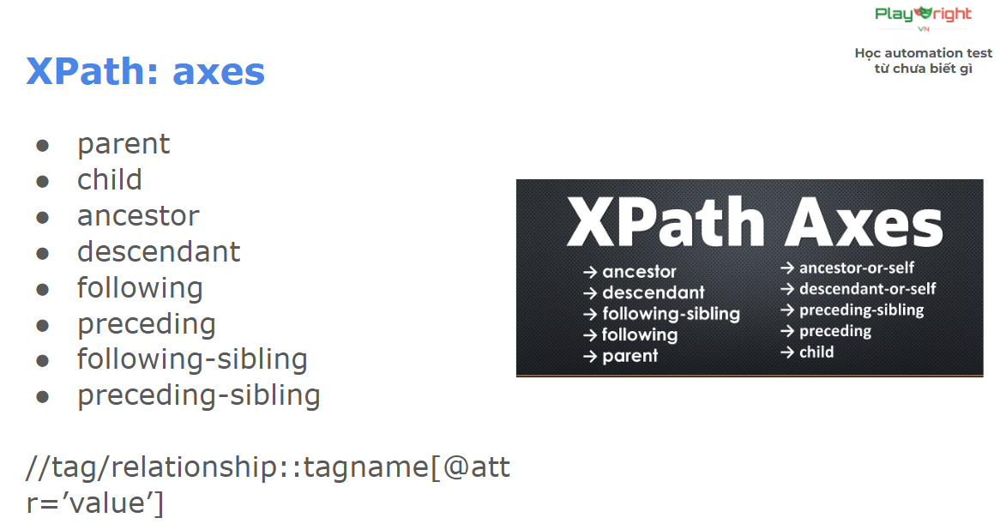

# Kiến thức tổng hợp

## 1. DOM

### 1.1 relation ###

>**Thay đổi commit message khi commit sai**

- **`self`** : node hiện tại
- **`parent`**: cha - là node phía trên trực tiếp của node hiện tại
- **`children`**: con - là node phía dưới trực tiếp của node hiện tại
- **`ancestor`**: tổ tiên
- **`descendant`**: hậu duệ - là các node con, cháu, chắt
- **`sibling`**: anh em - là những phần tử cùng cấp và cùng cha
- **`following`**: theo sau - gồm các node ở phía bên tay phải của node hiện tại (**NOTE**: ***không lấy*** những thằng con của node hiện tại)
- **`preceding`**: phía trước - gồm các node ở phía bên tay trái của node hiện tại, trừ các node ancestor
- **`following-sibling`**: anh em phía sau
- **`preceding-sibling`**: anh em phía trước

### 1.2 XPath - Advance methods ###

```markdown
- XPath axes methods (phương thức trục XPath) là các phương pháp để điều hướng và chọn các node trong cây DOM.
- XML/HTML dựa trên mối quan hệ giữa các node với nhau.
```

**`wildcard`** - **khớp tất cả**

```ts
//div -> khớp thẻ div
//* -> khớp tất cả các loại thẻ

<div class="form-group">
    <label for="testType">Testing Type:</label>
    <select id="testType" name="testType">
        <option value="blackbox">Black Box Testing</option>
        <option value="whitebox">White Box Testing</option>
        <option value="integration">Integration Testing</option>
        <option value="regression">Regression Testing</option>
    </select>
</div>
```

**`child`** - **Con trực tiếp**

```ts
# Tìm tất cả các button con trực tiếp của form
//form[@id='test-form']/child::button
```

**`descendant`** - **Tất cả con cháu**

```ts
# Tìm tất cả input bên trong form (mọi cấp)
//form[@id='test-form']/descendant::input
```

**`parent`** - **Cha**

```ts
# Tìm form cha của button "Create Test Case" 
//button[text()='Create Test Case']/parent::form
```

**`ancestor`** - **Tổ tiên**

```ts
# Từ button "Edit" trong table, tìm table tổ tiên
 //button[@class='btn-edit']/ancestor::table
```

**`following-sibling`** - **Anh em phía sau**

```ts
# Từ label "Test Case Name", tìm input cùng cấp ngay sau nó
//label[@for='testName']/following-sibling::input

# Kết quả: input#testName

# Từ cột "Test Name" có text "Login Validation", lấy các cột tiếp theo

//td[text()='Login Validation']/following-sibling::td
# Kết quả: cột Type, Priority, Status, Actions
```

**`preceding-sibling`** - **Anh em đứng trước**

```ts
# Từ button "Reset Form", tìm button đứng trước nó
//button[@class='btn-reset']/preceding-sibling::button

# Kết quả: button "Create Test Case"
```

**`following`** - **Tất cả node sau trong document**

```ts
# Từ h2 "Test Cases List", tìm tất cả button "Run Test" phía sau
//h2[text()='Test Cases List']/following::button[@class='btn-run']

# Kết quả: Tất cả 5 button "Run Test" trong bảng
```

**`ancestor-or-self`** - **Tổ tiên hoặc chính nó**

```ts
# Tìm tất cả span status trong table (bao gồm cả chính nó nếu là span)
//table[@id='test-table']/ancestor-or-self::span[contains(@class, 'status')]

# Kết quả: Tất cả span status-passed, status-running, status-failed, status-pending
```

**`preceding`** - **Tất cả node trước trong document**

```ts
# Từ h2 "Test Execution Results", tìm tất cả td có text "High" phía trước
//h2[text()='Test Execution Results']/preceding::td[@class='priority-high']

# Kết quả: TC001 và TC003 priority cells
```

**`descendent-or-self`** - **Con cháu hoặc chính nó**

```ts
# Tìm tất cả span status trong table (bao gồm cả chính nó nếu là span)
//table[@id='test-table']/descendant-or-self::span[contains(@class, 'status')]

# Kết quả: Tất cả span status-passed, status-running, status-failed, status-pending
```

**`Chứa thuộc tính`** - **@attribute**

```ts
Sử dụng @ để truy cập thuộc tính của element.
VD: //tagname[@attribute='value']
```

**`AND và OR operators`**

```ts
AND - Tất cả điều kiện phải đúng
//element[@condition1 and @condition2]

OR - Một trong các điều kiện đúng
//element[@condition1 or @condition2]

Kết hợp AND và OR
```

**`text()`** - **Lấy text bên trong element**

```ts
text() lấy text node trực tiếp của element.
//element[text()='exact text']
```

**`normalize-space()`** - **Chuẩn hóa khoảng trắng**

```ts
Loại bỏ khoảng trắng thừa ở đầu, cuối và giữa text.
normalize-space(string)
```

**`contains()`** - **Kiểm tra chứa chuỗi con**

```ts
Tìm element có chứa một phần text, không cần khớp chính xác.

//element[contains(@attribute, 'substring')]
//element[contains(text(), 'substring')]
```

### 1.3 XPath - axes ###

```ts
//tag/relationship::tagname[@attr=’value’]
```

